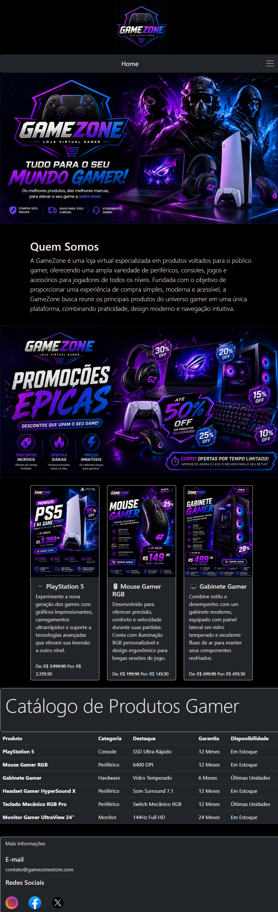
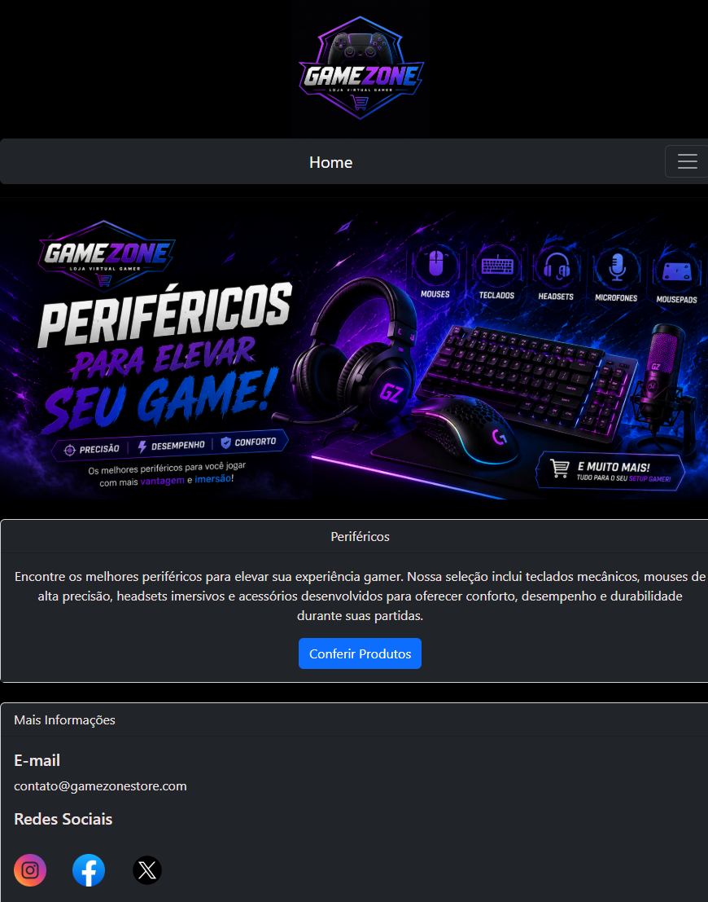
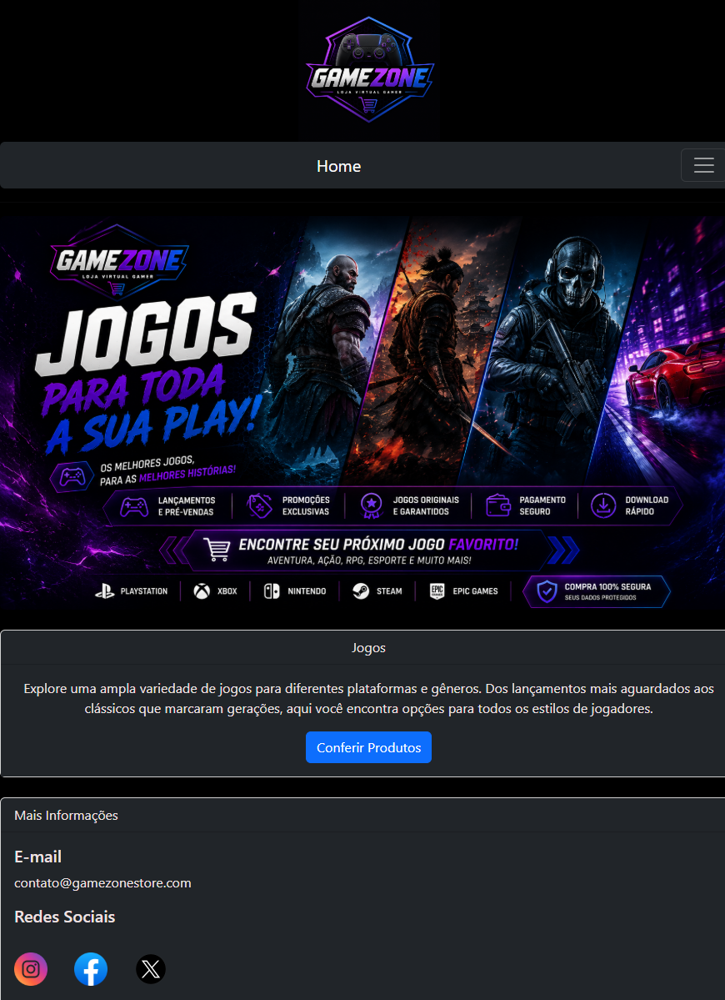
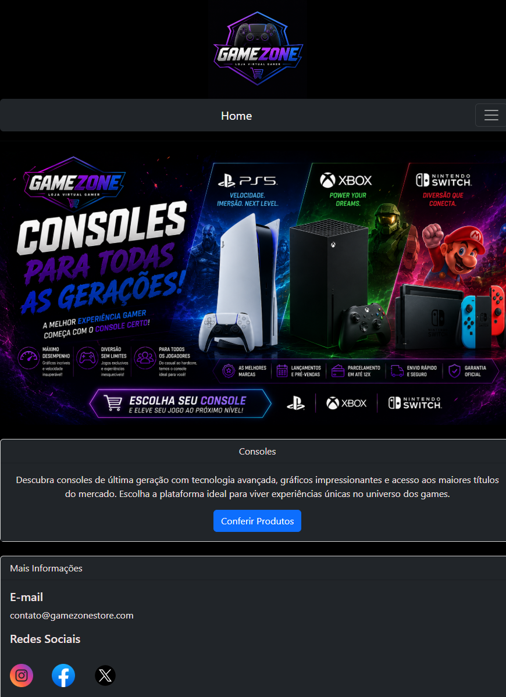
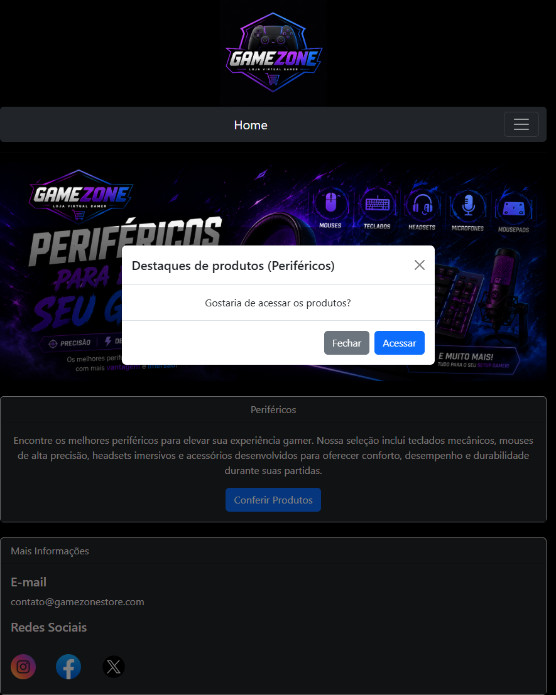
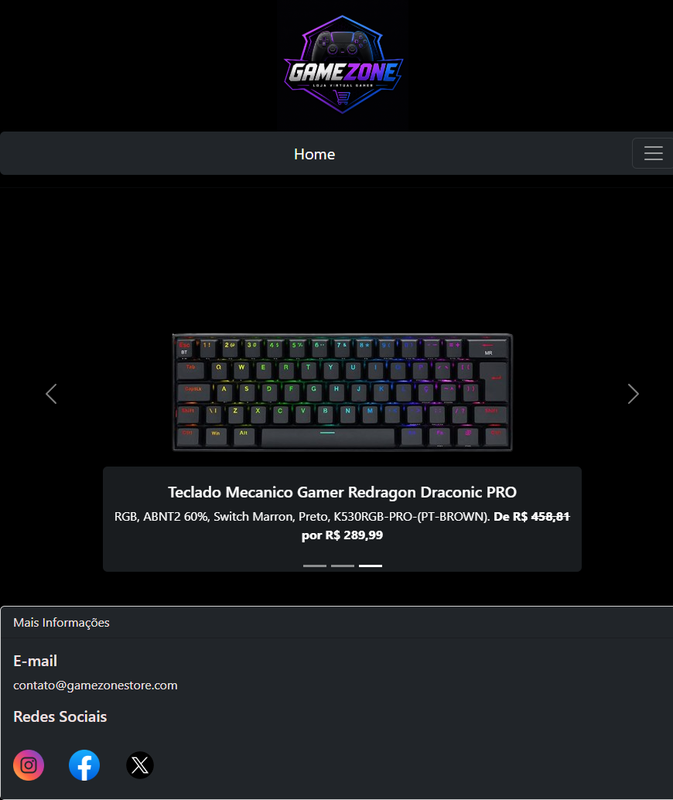
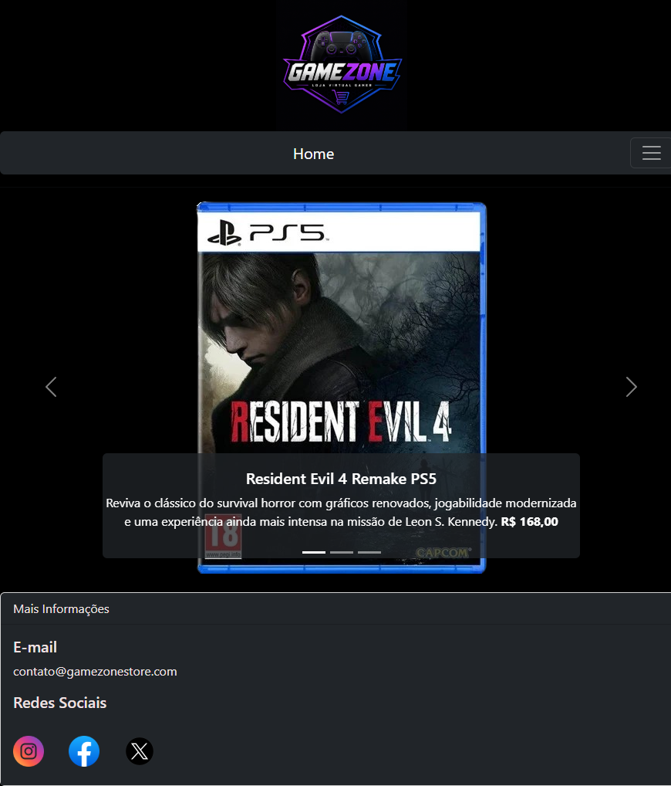
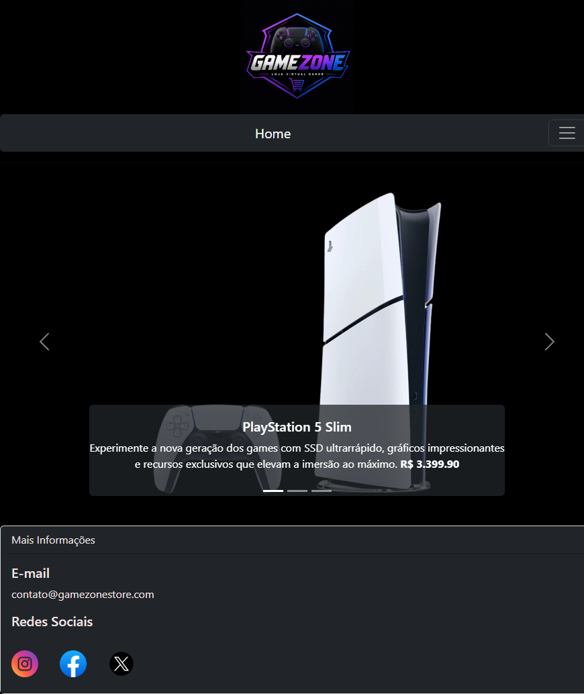
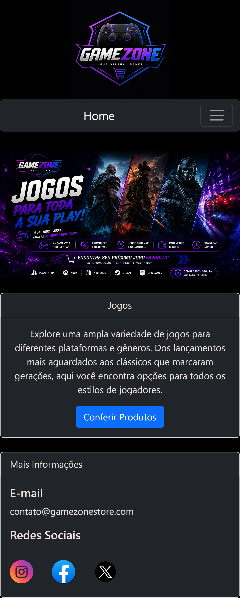

# Relato de implementação - Mini Projeto Frameworks CSS

## Grupo: Gustavo Henrique, Ian Oliveira, Isly do Nascimento, Kauan Pereira
## Tema: Frameworks CSS

## 📖 Descrição do projeto

A GameZone é uma loja virtual fictícia voltada para o público gamer. O projeto foi desenvolvido utilizando HTML5 e Bootstrap 5 com o objetivo de criar uma interface moderna, organizada e responsiva para apresentação de produtos relacionados ao universo dos jogos eletrônicos.

O sistema possui páginas dedicadas a periféricos, jogos e consoles, além de uma página inicial contendo informações sobre a empresa, promoções e catálogo de produtos.

---

# 🎯 1. Problema / Objetivo

O mercado gamer possui uma grande variedade de produtos e categorias, tornando importante a existência de plataformas organizadas e intuitivas para apresentação desses itens.

O objetivo deste projeto foi desenvolver uma aplicação web que simulasse uma loja virtual gamer, aplicando conceitos de desenvolvimento front-end, responsividade e organização de conteúdo.

Além disso, o projeto buscou:

- Aplicar conhecimentos de HTML5.
- Utilizar o framework Bootstrap 5.
- Criar uma interface responsiva.
- Desenvolver uma navegação intuitiva.
- Organizar produtos em categorias específicas.

---

# 🛠️ 2. Materiais e Métodos Utilizados para o Desenvolvimento

## Softwares Utilizados

### Visual Studio Code

Editor de código utilizado para o desenvolvimento do projeto.

Download:
https://code.visualstudio.com

### Navegador Web Brave

Utilizado para testes e visualização do projeto.

---

## Tecnologias Utilizadas

- HTML5
- Bootstrap 5.2
- CSS (Classes Bootstrap)
- JavaScript (Bootstrap Bundle) - Embora não tenham sido implementados scripts JavaScript próprios, foram utilizados componentes interativos do Bootstrap que dependem da biblioteca JavaScript disponibilizada pelo framework.

---

## Estrutura do Projeto

```text
GameZone/
│
├── index.html
├── perifericos.html
├── jogos.html
├── consoles.html
│
├── produtosperifericos.html
├── produtosjogos.html
├── produtosconsoles.html
│
└── Images/
```

---

# ⚙️ 3. Tutorial de Instalação

## Passo 1 - Instalar o Visual Studio Code

Acesse:

https://code.visualstudio.com

Faça o download e instale o editor.

---

## Passo 2 - Baixar ou Clonar o Projeto

Caso utilize Git:

```bash
git clone https://github.com/Ghopuser45/Mini-Projeto-Framework-CSS-Loja-GameZone.git
```

## Acessar a Pasta do Projeto

```bash
cd Mini-Projeto-Framework-CSS-Loja-GameZone
```

## Abrir o Projeto no Visual Studio Code

```bash
code .
```

Caso não utilize o git, você pode fazer o download dos arquivos compactados na página do repositório.

---

## Passo 3 - Abrir o Projeto

Abra a pasta GameZone no Visual Studio Code.

---

## Passo 4 - Executar o Projeto

Abra o arquivo:

```text
index.html
```

Utilize a extensão Live Server ou abra diretamente no navegador.

---

# 📝 4. Passo-a-Passo do Desenvolvimento

## Etapa 1 - Planejamento

Inicialmente foi definido o tema do projeto: uma loja virtual gamer.

Foram estabelecidas as seguintes categorias:

- Jogos
- Consoles
- Periféricos

---

## Etapa 2 - Criação da Página Inicial

Foi desenvolvida a página principal contendo:

- Logo da empresa
- Navbar de navegação
- Banner principal
- Seção "Quem Somos"
- Promoções
- Catálogo de produtos
- Informações de contato

### Resultado



---

## Etapa 3 - Desenvolvimento das Categorias

Foram criadas páginas específicas para:

- Periféricos
- Jogos
- Consoles

Cada página apresenta:

- Banner temático
- Descrição da categoria
- Modal para acesso aos produtos

### Resultado

- Página dos periféricos
  


- Página dos jogos
  


- Página dos consoles



- Exemplo de uso do modal para acessar os produtos da página de periféricos



---

## Etapa 4 - Desenvolvimento das Páginas de Produtos

Foi utilizado o componente Carousel do Bootstrap para apresentar os produtos.

### Recursos utilizados

- Carousel
- Cards
- Botões
- Imagens responsivas

### Resultado

- Página dos produtos relacionados a periféricos
  


- Página dos produtos relacionados a jogos
  


- Página dos produtos relacionados a consoles



---

## Etapa 5 - Implementação da Responsividade

A responsividade foi implementada utilizando:

- Meta Viewport
- Grid System do Bootstrap
- Navbar Responsiva
- Classes img-fluid
- Componentes responsivos do Bootstrap

### Resultado

- Exemplo da implementação de responsividade em dispositivos móveis



## Etapa 6 - Testes

Foram realizados testes para verificar:

- Navegação entre páginas
- Funcionamento dos modais
- Funcionamento dos carrosséis
- Adaptação em diferentes tamanhos de tela
- Carregamento das imagens

---

# 📊 5. Resultados Alcançados

Ao final do desenvolvimento foi obtido um site funcional para uma loja virtual gamer contendo:

✅ Página inicial completa

✅ Navegação entre páginas

✅ Catálogo de produtos

✅ Seções específicas para jogos, consoles e periféricos

✅ Modais interativos

✅ Carrosséis de produtos

✅ Layout responsivo

✅ Interface moderna baseada em Bootstrap

O projeto atingiu os objetivos propostos e demonstrou a aplicação prática dos conceitos estudados em desenvolvimento web.

---

# ✅ 6. Conclusão

O desenvolvimento da GameZone permitiu aplicar conhecimentos de HTML5, Bootstrap e design responsivo na construção de uma aplicação web voltada para o público gamer.

A utilização do Bootstrap facilitou a implementação de componentes modernos como Navbar, Carousel, Modal, Cards e Grid System, além de contribuir para a responsividade do site.

Os resultados obtidos demonstram que os objetivos foram alcançados com sucesso, resultando em uma aplicação organizada, funcional e visualmente agradável.


